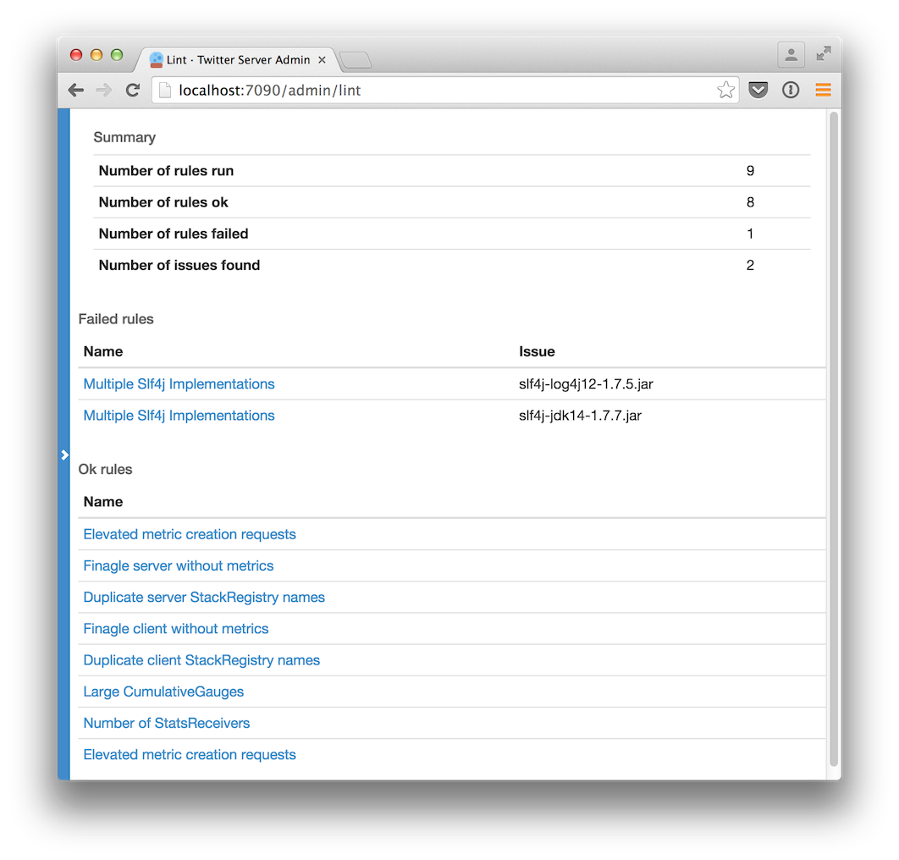
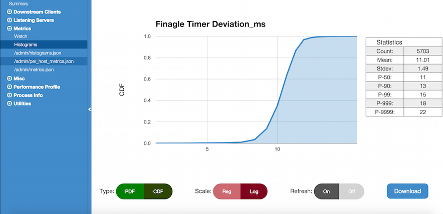

HTTP Admin interface
====================

.. _admin_interface:

TwitterServer starts an HTTP server and includes a variety of tools
for diagnostics, profiling, and more.
It binds to the port defined by the :ref:`flag <flags>`
`-admin.port` and uses port 9990 by default.

Visit `/admin` on your service's admin port in a web browser to see what is
available.

.. image:: ../../img/intro.png

TwitterServer defines a series of default endpoints grouped into a variety
of categories.

- :ref:`Process Info <admin_info>`
- :ref:`Utilities <admin_utilities>`
- :ref:`Metrics <admin_metrics>`
- :ref:`Profiling <admin_profile>`
- :ref:`Downstream Clients <admin_clients>`
- :ref:`Listening Servers <admin_servers>`

Process Info
------------

.. _admin_info:

Endpoints that provide insights into your service's configuration and usage.

/admin/lint
~~~~~~~~~~~

Runs and displays the results for all registered linters to check for various
service issues. This can help you identify misuse or abuse of functionality.

/admin/threads
~~~~~~~~~~~~~~

A user interface for capturing the current stacktraces. Includes filtering
of inactive threads as well as deadlock detection. JSON output is also available
through tools like curl via the inspection of the HTTP Accept header.

.. image:: ../../img/threads.png

/admin/registry.json
~~~~~~~~~~~~~~~~~~~~

Displays how the service is currently configured across a variety of dimensions
including the client stack, server stack, flags, service loader values,
system properties, environment variables, build properties and more.

.. image:: ../../img/registry.png

The HTTP request parameter `filter` allows for simple filtering of the returned data.
The value takes the form "path/to/data" and returns registry entries whose prefix
matches the parameter. A glob, `*`, can be used to match any component of the path.
For example, using "filter=registry/server/http" will output all Finagle Http servers.
Using "filter=registry/client/\*/user_service" would output all Finagle clients with
a label of "user_service" regardless of protocol.

Due to the usage of `/` as a delimiter, it means you cannot match components
containing a `/`. The choice of `*` as a glob also means you cannot match registry
components with the exact value of `*`. For these use cases, there is the
more powerful `jq <https://stedolan.github.io/jq/>`_ command-line JSON processing
tool.

/admin/balancers.json
~~~~~~~~~~~~~~~~~~~~~

Shows details about client load balancers, including both configuration
and current status.

The HTTP request parameter `label` allows for filtering down to a client
whose label matches that.

Example JSON output:

::

  {
    "clients" : [
      {
        "label" : "cool_service",
        "info" : {
          "balancer_class" : "P2CLeastLoaded",
          "size" : 1,
          "total_pending" : 0,
          "number_available" : 1,
          "number_busy" : 0,
          "additional_info" : { },
          "status" : "Open",
          "number_closed" : 0,
          "total_load" : 0.0
        }
      }
    ]
  }

/admin/server_info
~~~~~~~~~~~~~~~~~~

Return build information about this server.
See `/admin/registry.json` for this in addition to other details.

::

  {
    "name" : "myserver",
    "version" : "1.0.0-SNAPSHOT",
    "build" : "20130221-105425",
    "build_revision" : "694299d640d337c58fadf668e44322b17fd0562e",
    "build_branch_name" : "refs/heads/twitter-server!doc",
    "build_last_few_commits" : [
      "694299d (HEAD, origin/twitter-server!doc, twitter-server!doc) Merge branch 'master' into twitter-server!doc",
      "ba1c062 Fix test for sbt + Jeff's comments",
    ],
    "start_time" : "Thu Feb 21 13:43:32 PST 2013",
    "uptime" : 22458
  }

/admin/announcer
~~~~~~~~~~~~~~~~

Returns a set of announcement chains that have run through the
`Announcer`. This allows one to see how a particular target is being
announced.

Utilities
---------

.. _admin_utilities:

Endpoints that cover various utilities that developers can manipulate at runtime.

/admin/tracing
~~~~~~~~~~~~~~

Enable (`/admin/tracing?enable=true`) or disable tracing (`/admin/tracing?disable=true`)

See `zipkin <https://github.com/openzipkin/zipkin>`_ documentation for more info
regarding tracing.

/admin/logging
~~~~~~~~~~~~~~

Display the set of loggers and their current log level. The level of
each logger can also be modified on-the-fly.

.. image:: ../../img/logging.png

/admin/toggles
~~~~~~~~~~~~~~

See and modify the server's in-memory mutable `com.twitter.finagle.toggle.Toggles`.

`GET` requests show the current state of all `StandardToggleMap StandardToggleMaps`.
Requests should be of the form `/admin/toggles{/$libraryName}{/$id}`.
Note that the library name and toggle id components are optional and allow
for filtering the output on those constraints.
The output is JSON and it looks roughly like:

::

  {
    "libraries": [
      {
        "libraryName" : "$libraryName",
        "toggles" : [
          {
            "current" : {
              "id" : "$id",
              "fraction" : $fraction,
              "description" : "$description"
            },
            "components" : [
              {
                "source" : "$ToggleMapSource",
                "fraction" : $fraction
              },
              { <other sources here> }
            ]
          },
          { <other toggles here> }
        ]
      },
      { <other libraries here> }
    ]
  }

There will be a hash for each library registered with
`com.twitter.finagle.toggle.StandardToggleMap`. For each `Toggle`
the "current" hash shows the current configuration while the
"components" array has a hash per `ToggleMap` source. These
are ordered by evaluation order and as such, sources earlier in a
component array are used first.

`PUT` requests allow for updates/creation of the mutable `Toggles`
while `DELETE` requests allow for removal. These apply only to the
`ToggleMap.Mutable` `ToggleMaps` within a `StandardToggleMap`.
Requests must be of the form `/admin/toggles/$libraryName/$id`.
For create and update, and an additional `fraction` request parameter
must be set as well.

/admin/tunables
~~~~~~~~~~~~~~~

See and modify the server's in-memory mutable `com.twitter.util.tunable.Tunables`.

`GET` requests to `/admin/tunables` show the current state of all registered
`StandardTunableMap StandardTunableMaps`. The returned JSON is of the form:

::

  [
    {
      "id" : "$id",
      "tunables" : [
        {
          "id" : "$tunableId",
          "value" : "$value",
          "components" : [
            {
              "source" : "$TunableMapSource",
              "value" : "$value"
            },
            { <other components here> }
          ]
        },
        { <other tunables here> }
      ]
    },
    { <other ids here> }
  ]

`GET` requests to `/admin/tunables/$id` show the current state of the StandardTunableMap
registered for `$id`.

`PUT` and `DELETE` requests to `/admin/tunables/$id` update the in-memory Tunables for `$id`
and should have a JSON body in the same format as a `Tunable` configuration file,
detailed in
`JsonTunableMapper <https://github.com/twitter/util/blob/release/util-tunable/src/main/scala/com/twitter/util/tunable/JsonTunableMapper.scala>`_:

::

  {
    "tunables":
      [
         {
            "id" : "$tunableId",
            "value" : $value,
            "type" : "$class"
         },
         { <other updates here> }
      ]
  }

For a `PUT` request, these `Tunables` will be updated or added. Note that `PUT` requests
will *not* cause any existing `Tunables` to be removed.

For a `DELETE` request, these `Tunables` will cleared from the `TunableMap`. The `Tunables` are keyed
by "id" and "type"; the "value" for each of `Tunables` to delete can be any valid value for this
`Tunable`. Because the value of a `Tunable` is the result of a composition of `TunableMaps`
(see `StandardTunableMap <https://github.com/twitter/finagle/blob/release/finagle-tunable/src/main/scala/com/twitter/finagle/tunable/StandardTunableMap.scala>`_), deleting an in-memory Tunable will cause the value from the
composition of the other TunableMaps to be used.

Metrics
-------

.. _admin_metrics:

Endpoints regarding your service's metrics. The `Finagle User Guide
<https://twitter.github.io/finagle/guide/Metrics.html>`_ explains what
many of them represent.

/admin/metrics
~~~~~~~~~~~~~~

This metrics endpoint provides the ability to both watch specific metrics in
real-time, as well as download data for a specific metric. It is available in
TwitterServer regardless of the particular stats library implementation you are
using.

Selecting the `Watch` menu item or navigating to the page directly in your web
browser displays all of the reported metrics for this TwitterServer instance.
Choosing an individual metric from the list will allow you to watch how its
value changes over time.

.. image:: ../../img/metric_watch.png

If you know the exact name of the metric that you would like to watch, you can
use a fragment (named anchor) within the url to navigate directly to viewing
that specific metric.

::

  /admin/metrics#mediainfo/mux/failuredetector/ping

If you would like to download data for an individual metric instead, you may use
the `m` request parameter with the full metric name. The response returned will be
JSON and include the name, delta (change since the metric was last sampled), and
value (instantaneous value) for the specific metric.

::

  /admin/metrics?m=mediainfo/mux/failuredetector/ping

::

  [
    {
      "name" : "mediainfo/mux/failuredetector/ping",
      "delta" : 3560.0,
      "value" : 41939.0
    }
  ]

You may specify as many `m` parameters as you like, one fore each metric you would like to retrieve.

::

  /admin/metrics?m=exceptions&m=jvm/uptime

::

  [
    {
      "name" : "jvm/uptime",
      "delta" : 8.3826464E7,
      "value" : 8.3826464E7
    },
    {
      "name" : "exceptions",
      "delta" : 0.0,
      "value" : 0.0
    }
  ]

/admin/metrics.json
~~~~~~~~~~~~~~~~~~~

Export a snapshot of the current statistics of the program. You can
use the StatsReceiver in your application for add new
counters/gauges/histograms, simply use the `statsReceiver` variable
provided by TwitterServer.

This endpoint is available when you are using the `finagle-stats` library.
See the :ref:`metrics <metrics_label>` section for more information.

/admin/histograms
~~~~~~~~~~~~~~~~~

Visualize and download histogram-style metrics.  The metrics endpoint exposes a
summary of the histogram, but it doesn't expose the full histogram.  The full
histogram can be useful for seeing the different modes of your metric, which often
represent different states of your program.

This endpoint is available when you are using the `finagle-stats` library.
See the :ref:`metrics <metrics_label>` section for more information.

For more details, please see the features
`documentation <https://twitter.github.io/twitter-server/Features.html>`_.

/admin/histograms.json
~~~~~~~~~~~~~~~~~~~~~~

Export a snapshot of a histogram-style metric in json. This exports the entire
histogram, which can be used for correctly aggregating over a cluster, or to
efficiently record historic histogram data, or to compare modes in different
usages patterns, like times of day.  You may add new histograms by adding new
stats to your `statsReceiver` variable.

This endpoint is available when you are using the `finagle-stats` library.
See the :ref:`metrics <metrics_label>` section for more information.

/admin/metric_metadata.json
~~~~~~~~~~~~~~~~~~~~~~~~~~~
Export metadata information about metrics in json. By default, this exports metadata for every metric. An optional argument `name` can be added to query for a single metric's metadata. Multiple names may be passed in using that argument multiple times. 

NB: for a histogram, it may be looked up with or without its metrics.json suffix (.sum, .p95, .max, etc).

::

  /admin/metric_metadata.json?name=http/requests&name=strato_rpc_client/latency_ms.p95

::

  {
    "@version" : 3.1,
    "counters_latched" : true,
    "separator_char" : "/",
    "metrics" : [
      {
        "name" : "http/requests",
        "relative_name" : [
          "requests"
        ],
        "kind" : "counter",
        "source" : {
          "class" : "Unspecified",
          "category" : "Server",
          "process_path" : "Unspecified"
        },
        "description" : "No description provided",
        "unit" : "Unspecified",
        "verbosity" : "Verbosity(default)",
        "key_indicator" : false
      },
      {
        "name" : "strato_rpc_client/latency_ms",
        "relative_name" : [
          "latency_ms"
        ],
        "kind" : "histogram",
        "source" : {
          "class" : "Unspecified",
          "category" : "Client",
          "process_path" : "Unspecified"
        },
        "description" : "No description provided",
        "unit" : "Unspecified",
        "verbosity" : "Verbosity(default)",
        "key_indicator" : false,
        "buckets" : {
          "count" : ".count",
          "sum" : ".sum",
          "average" : ".avg",
          "minimum" : ".min",
          "maximum" : ".max",
          "0.5" : ".p50",
          "0.9" : ".p90",
          "0.95" : ".p95",
          "0.99" : ".p99",
          "0.999" : ".p9990",
          "0.9999" : ".p9999"
        }
      }
    ]
  }

Top-level/instance-wide Fields:
^^^^^^^^^^^^^^^^^^^^^^^^^^^^^^^
:@version: the current version of the response document (format: Major.minor).
:counters_latched: a bool indicating whether or not the service is using latched counters.
:separator_char: the character used to separate path fields in a metric name.
:metrics: an array containing Metadata objects for each metric.

Metadata Object Fields:
^^^^^^^^^^^^^^^^^^^^^^^
:name: the fully-qualified name of the metric for this particular Metadata object.
:relative_name: an array containing the field names constituting a suffix which is common across all library users. While the prefix may be configurable, metrics with a shared `relative_name` can be considered alike.
:kind: a string representing the metric type (counter, gauge or histogram).
:source: an object which describes where the metric comes from (see next section for source-level fields).
:description: text description of the metric intended for human consumption.
:unit: the appropriate unit for this metric (ex, milliseconds, megabytes, count).
:verbosity: the metrics logging verbosity level.
:key_indicator: a bool indicating whether or not this metric is part of this services top-level indicators or golden metrics.
:counterish_gauge: a bool indicating if a gauge represents a count of something over the lifetime of the instance. Note that it does not follow the same latching rules as standard counters. This key will not be present unless it is true. It can only be present on gauge-type metrics.
:buckets: a map from histogram components (percentiles, max, min, sum, etc) to the suffix which completes this metrics name in metrics.json (only present for histograms).

Source Object Fields:
^^^^^^^^^^^^^^^^^^^^^
:class: a string containing the name of the scala/java class that generated this metric (not currently populated).
:category: currently either "Server" or "Client" indicating whether the metric pertains to this server or one of its downstreams, but may be expanded in the future. Should be treated as a string.
:process_path: a string indicating the relevant downstream, when there is one.

/admin/metric/expressions.json
~~~~~~~~~~~~~~~~~~~~~~~~~~~~~~
Export metadata information about metric expressions in json. These metadata represent commonly used metric queries for the service.

::

  /admin/metric/expressions.json?name=success_rate

::

  {
    "@version" : 0.7,
    "counters_latched" : true,
    "separator_char" : "/",
    "expressions" : [
      {
        "name" : "success_rate",
        "labels" : {
          "process_path" : "Unspecified",
          "service_name" : "thrift",
          "role" : "Client"
        },
        "expression" : "multiply(100.0,divide(rate(clnt/thrift/success),plus(rate(clnt/thrift/success),rate(clnt/thrift/failures))))",
        "bounds" : {
          "kind" : "monotone",
          "operator" : ">",
          "bad_threshold" : 99.5,
          "good_threshold" : 99.97,
          "lower_bound_inclusive" : null,
          "upper_bound_exclusive" : null
        },
        "description" : "The Success Rate",
        "unit" : "Percentage"
      },
    ]
  }

Top-level/instance-wide Fields:
^^^^^^^^^^^^^^^^^^^^^^^^^^^^^^^
:@version: the current version of the response document (format: Major.minor).
:counters_latched: a bool indicating whether or not the service is using latched counters.
:separator_char: the character used to separate path fields in a metric name.
:expressions: an array containing a Metadata object for each metric expression.

Expression Object Fields:
^^^^^^^^^^^^^^^^^^^^^^^^^
:name: a string representing the name or significance of the expression.
:labels: a dictionary (string -> string) with additional metadata about the metric
:expresssion: a string representation illustrating how to aggregate metrics into the expression value.
:bounds: an object which describes the bounds for what values resulting from the expression should be considered "healthy" for the service.
:description: text description of the expression, intended for human consumption.
:unit: the appropriate unit for this metric (ex, milliseconds, megabytes, count).

Labels Entries:
^^^^^^^^^^^^^^^
Although it should be interpreted as a dictionary, not as an object, there are some common fields that are often relevant, especially for Finagle services.

:process_path: a string indicating the relevant downstream, when there is one.
:service_name: a string representing the Finagle service name. particularly helpful for services containing multiple internal servers (ex, thrift and http).
:role: either "Server" or "Client" indicating whether the expression pertains to this server or one of its downstreams. Should be treated as a string.

Bounds Object Fields:
^^^^^^^^^^^^^^^^^^^^^
:kind: a string indicating what type of bounds these are: "unbounded" (no bounds), "monotone" (only considered unhealthy in one direction), or "range" (there is a range of healthy values, above or below them is unhealthy).
:operator: a string indicating which whether the bounds should be treated as floors or ceilings (ex, ">", "<").
:bad_threshold: the value that represents the boundary between a bad and an ok value for the expression.
:good_threshold: the value that represents the boundary between an ok and a good value for the expression.
:lower_bound_inclusive: an optional value below the bad_threshold which indicates a boundry below which values are considered invalid or erroneous rather than unhealthy.
:upper_bound_exclusive: an optional value above the good_threshold which indicates a boundry above which values are considered invalid or erroneous rather than unhealthy.

Profiling
---------

Endpoints for profiling your process.

.. _admin_profile:

/admin/pprof/contention
~~~~~~~~~~~~~~~~~~~~~~~

Returns a CPU contention profile which identifies blocked threads
(`Thread.State.BLOCKED`).
The output is in `pprof <https://github.com/gperftools/gperftools>`_ format.
The process will be profiled for 10 seconds at a frequency of 100 hz. These
values can be controlled via HTTP request parameters `seconds` and `hz`
respectively.

/admin/contention
~~~~~~~~~~~~~~~~~

Show call stacks of blocked and waiting threads.

::

  $ curl localhost:9990/admin/contention
  Blocked:
  "util-jvm-timer-1" Id=11 TIMED_WAITING on java.util.concurrent.locks.AbstractQueuedSynchronizer$ConditionObject@33aac3c
    at sun.misc.Unsafe.park(Native Method)
    -  waiting on java.util.concurrent.locks.AbstractQueuedSynchronizer$ConditionObject@33aac3c
    at java.util.concurrent.locks.LockSupport.parkNanos(LockSupport.java:226)
    at java.util.concurrent.locks.AbstractQueuedSynchronizer$ConditionObject.awaitNanos(AbstractQueuedSynchronizer.java:2082)
    at java.util.concurrent.ScheduledThreadPoolExecutor$DelayedWorkQueue.take(ScheduledThreadPoolExecutor.java:1090)
    at java.util.concurrent.ScheduledThreadPoolExecutor$DelayedWorkQueue.take(ScheduledThreadPoolExecutor.java:807)
    at java.util.concurrent.ThreadPoolExecutor.getTask(ThreadPoolExecutor.java:1043)
    at java.util.concurrent.ThreadPoolExecutor.runWorker(ThreadPoolExecutor.java:1103)
    at java.util.concurrent.ThreadPoolExecutor$Worker.run(ThreadPoolExecutor.java:603)
    ...

/admin/pprof/profile
~~~~~~~~~~~~~~~~~~~~

Returns a CPU usage profile. The output is in `pprof
<https://github.com/gperftools/gperftools>`_ format.
The process will be profiled for 10 seconds at a frequency of 100 hz. These
values can be controlled via HTTP request parameters `seconds` and `hz`
respectively.

::

  $ curl -s localhost:9990/admin/pprof/profile > /tmp/cpu_profiling
  $ pprof --text /tmp/cpu_profiling
  Using local file /tmp/cpu_profiling.
  Using local file /tmp/cpu_profiling.
  Total: 83 samples
        17  20.5%  20.5%       24  28.9% com.twitter.finagle.ProxyServiceFactory$class.status
         8   9.6%  30.1%       10  12.0% scala.collection.immutable.HashMap$HashTrieMap.updated0
         5   6.0%  36.1%       70  84.3% scala.collection.Iterator$class.foreach
         5   6.0%  42.2%        5   6.0% scala.runtime.ScalaRunTime$.hash
         4   4.8%  47.0%        4   4.8% com.twitter.finagle.transport.Transport$$anon$2.status
         4   4.8%  51.8%        4   4.8% sun.management.OperatingSystemImpl.getOpenFileDescriptorCount
         3   3.6%  55.4%        9  10.8% com.twitter.finagle.Filter$$anon$2.status
         ...

/admin/pprof/heap
~~~~~~~~~~~~~~~~~

Returns a heap profile computed by the `heapster agent
<https://github.com/mariusae/heapster>`_.  The output is in
`pprof <https://github.com/gperftools/gperftools>`_ format.

::

  $ java -agentlib:heapster -jar target/myserver-1.0.0-SNAPSHOT.jar
  $ pprof /tmp/heapster_profile
  Welcome to pprof!  For help, type 'help'.
  (pprof) top
  Total: 2001520 samples
   2000024  99.9%  99.9%  2000048  99.9% LTest;main
      1056   0.1% 100.0%     1056   0.1% Ljava/lang/Object;
       296   0.0% 100.0%      296   0.0% Ljava/lang/String;toCharArray
       104   0.0% 100.0%      136   0.0% Ljava/lang/Shutdown;

Downstream Clients
------------------

.. _admin_clients:

The `Finagle clients <https://twitter.github.io/finagle/guide/Clients.html>`_
that your service depends on.

/admin/clients
~~~~~~~~~~~~~~

Surface client information exposed by Finagle. Per-client configuration parameters and
values for each module are available at `/admin/clients/<client name>`.

Listening Servers
-----------------

.. _admin_servers:

The `Finagle servers <https://twitter.github.io/finagle/guide/Servers.html>`_
that your service is running.

/admin/servers
~~~~~~~~~~~~~~

Surface server information exposed by Finagle. Per-server configuration parameters and
values for each module are available at `/admin/servers/<server name>`.

/admin/servers/connections
~~~~~~~~~~~~~~~~~~~~~~~~~~

Expose information about currently connected clients including encryption status,
if available.
